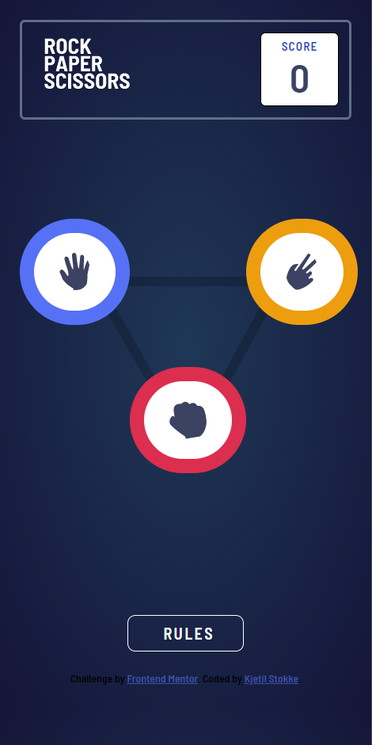
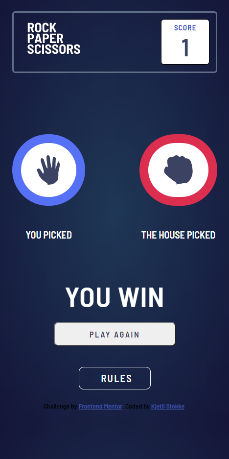
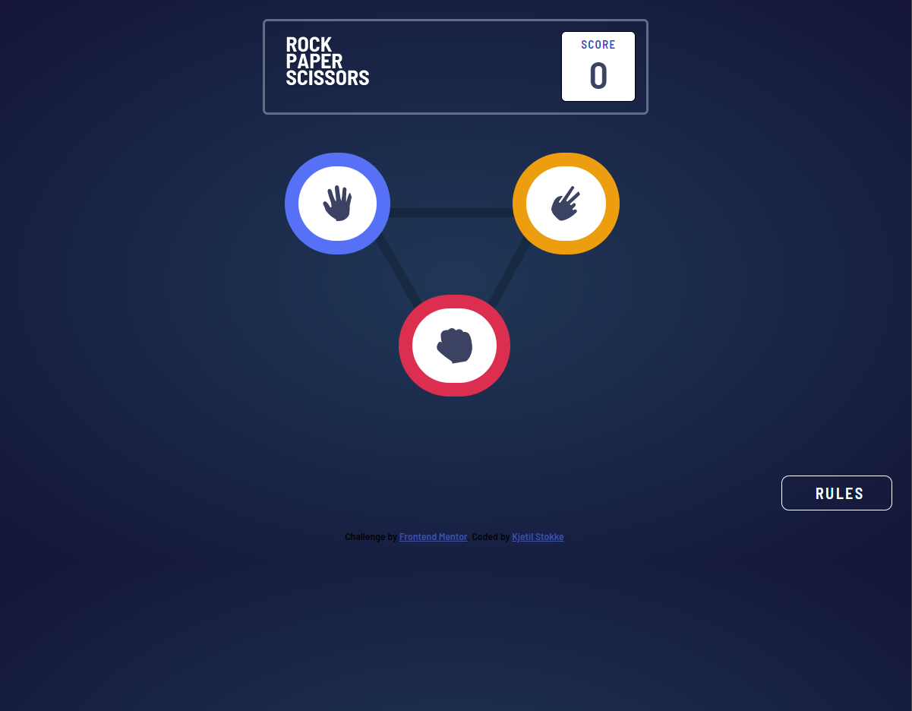
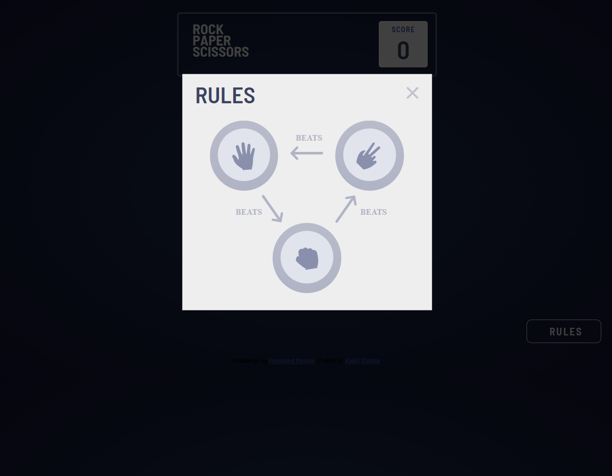
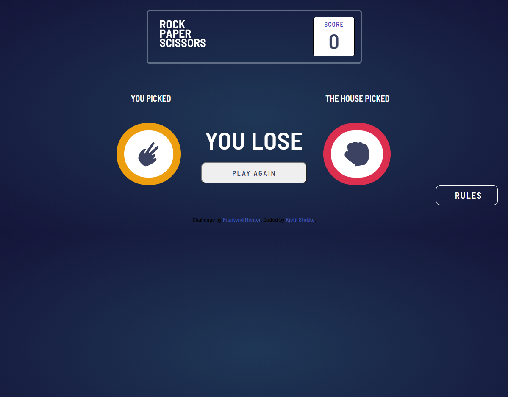

# Frontend Mentor - Rock, Paper, Scissors solution

This is a solution to the [Rock, Paper, Scissors challenge on Frontend Mentor](https://www.frontendmentor.io/challenges/rock-paper-scissors-game-pTgwgvgH). Frontend Mentor challenges help you improve your coding skills by building realistic projects. 

## Table of contents

- [Overview](#overview)
  - [The challenge](#the-challenge)
  - [Screenshot](#screenshot)
  - [Links](#links)
- [My process](#my-process)
  - [Built with](#built-with)
  - [What I learned](#what-i-learned)
  - [Continued development](#continued-development)
  - [Useful resources](#useful-resources)
- [Author](#author)

## Overview

### The challenge

Users should be able to:

- View the optimal layout for the game depending on their device's screen size ✔️
- Play Rock, Paper, Scissors against the computer ✔️
- Maintain the state of the score after refreshing the browser _(optional)_ 🔜
- **Bonus**: Play Rock, Paper, Scissors, Lizard, Spock against the computer _(optional)_ 🔜

### Screenshot

**Mobile**

 

**Desktop**

  

### Links

- Solution URL: [Solution URL](https://github.com/h131177/Frontend-Mentor-Projects/tree/master/Rock-Paper-Scissors%20Game)
- Live Site URL: [Github Pages URL](https://h131177.github.io/Frontend-Mentor-Projects/Rock-Paper-Scissors%20Game/index.html)

## My process

### Built with

- HTML5
- CSS Grid
- Mobile-first approach
- Javascript

### What I learned

Use this section to recap over some of your major learnings while working through this project. Writing these out and providing code samples of areas you want to highlight is a great way to reinforce your own knowledge.

**All "states" of the game in one HTML document** 
- Using javascript to add/remove .hidden class, to show the correct elements for that "state"
```html
<p class="hidden">YOU PICKED</p>
<p class="hidden">THE HOUSE PICKED</p>
<div class="result hidden">
  <p data-result>YOU LOSE</p>
  <button>PLAY AGAIN</button>
</div>
```
```css
.hidden {
    display: none;
}
```

**CSS only Modal**
- Display modal when you click on the div with the anchor tag using css :target
```css
#modal:target {
    display: block;
}
```

**Window matchMedia() Method**
- Adds a llstener when the "state" of the game changes and remove it when it changes back
- Used to show the correct design for both states (play game and show result)
```js
//Adds a listener for viewport over 960px
const x = window.matchMedia("(min-width: 960px)");

//function to check viewport size
function checkViewportOver960px(x) {
    if (x.matches) { // If media query matches
        playGround.style.maxWidth = "520px";
        play2.style.alignSelf = "flex-end";
        play3.style.alignSelf = "flex-end";
    } else {
        playGround.style.maxWidth = "360px";
        play2.style.alignSelf = "flex-start";
        play3.style.alignSelf = "flex-start";
    }
}

checkViewportOver960px(x); // Call listener function at run time
x.addEventListener("change", checkViewportOver960px); // Attach listener function on state changes
```

****

If you want more help with writing markdown, we'd recommend checking out [The Markdown Guide](https://www.markdownguide.org/) to learn more.

### Useful resources

- [TheNetNinja Youtube Channel](https://www.youtube.com/c/TheNetNinja) - He is just amazing. Before I started this challenge, I have seen many of his videos about html, css and js. You NEED to check out his channel, great teacher.
- [Codingflag Youtube Channel](https://www.youtube.com/watch?v=bH6Xcszq2tQ) - First I found a tutorial on how to make a modal box with css and js on w3schools website, but I wanted to do it without js. I found this youtube video very helpful for building a modal with css only.
- [w3schools](https://www.w3schools.com/jsref/met_win_matchmedia.asp) - This js reference helped me alot when I was stuck on how to show the correct design when the state changes both in both mobile and desktop.
- [w3schools CSS Reference](https://www.w3schools.com/cssref/default.asp) - I used it to find the correct javaScript syntax when using object.style for changing styles with javascript. Because it is not allways the same name as in css.


## Author

- Frontend Mentor - [@h131177](https://www.frontendmentor.io/profile/h131177)
